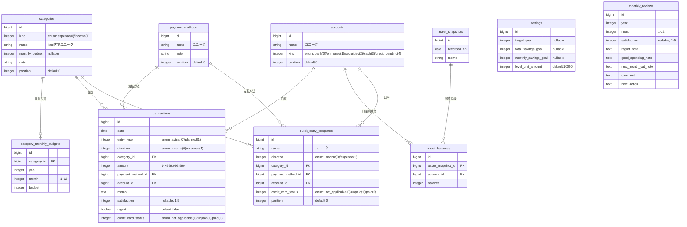

# 家計簿アプリケーション仕様書

## 0. 位置づけ

本書は `docs/要件定義書.md`（Excelからの移行時に作成した初版の要件定義書、2026-08-13時点）に対して、**その後の実装内容に追従して更新していく仕様書**である。

- `docs/要件定義書.md` … 移行時点のスナップショット。背景・移行方針・決定事項ログなど「なぜこう作ったか」の記録として今後もそのまま残す。
- 本書 `docs/アプリケーション仕様書.md` … **現時点の実装が正**。機能追加・仕様変更を行った際は本書を更新し、「今のアプリが何をするか」を常に本書だけで把握できる状態を保つ。両者の内容が食い違う場合は本書を優先する。

最終更新: 2026-08-28（コミット `1b1a125` 時点の実装を基に作成）

## 1. 概要

Excel家計簿「MONEY QUEST」をRailsアプリとして再構築した、個人利用の家計簿アプリ。v1と同様に**単一利用者・認証なし**を前提とする。

- 日々の収支（取引）を記録する
- 任意タイミングで口座別の資産残高（スナップショット）を記録する
- ダッシュボードで貯金の進捗をゲーム風（貯金レベル）に可視化する
- 月末に振り返り（満足度・後悔支出など）を記録する

## 2. 技術スタック

| 項目 | 内容 |
|---|---|
| 言語・フレームワーク | Ruby 3.3.2 / Rails 7.1.6 |
| フロントエンド | Hotwire（importmap + Turbo + Stimulus）、独自CSS（ライブラリ不使用） |
| グラフ描画 | 外部JSライブラリ不使用。`SvgLineChartHelper` によるインラインSVG自前実装（ダークモード対応、CSSカスタムプロパティで配色を参照） |
| DB（開発・テスト） | MySQL |
| DB（本番） | PostgreSQL（Supabase のConnection Pooler経由） |
| テスト | RSpec（モデル層のみ、`spec/models/*`） |
| デプロイ | Render（無料プラン、Dockerfileベース） |
| PWA対応 | `public/manifest.json`、各種アイコン、`apple-mobile-web-app-*` メタタグ |

### 運用上の工夫

- Renderの無料プランはアクセスがないとスリープするため、`GET /ping` に外部cronから定期アクセスしてスリープを防止する。`PingController` は `ApplicationController` を継承せず、DBアクセス・ビューレンダリングを一切行わない最小コストの応答（`head :ok`）のみを返す。
- `ApplicationController` で `ArgumentError`（enumに未定義の値を渡された場合など、不正なパラメータ改ざん時に発生）を捕捉し、未処理の500ではなく400を返す。

## 3. 画面構成・ナビゲーション

下部固定ナビゲーション（ボトムナビ）に5項目。

| アイコン | 項目 | 遷移先 |
|---|---|---|
| 🏠 | ホーム | ダッシュボード（ルートパス） |
| 💰 | 取引 | 取引一覧 |
| 📊 | 資産 | 資産スナップショット一覧 |
| 📈 | 集計 | 月別集計（閲覧専用） |
| ⋯ | その他 | 月次振り返り／カテゴリ／口座／支払方法／月別予算／全体設定への入口 |

「その他」配下の画面（月次振り返り、カテゴリ、口座、支払方法、月別予算、全体設定）はボトムナビ上では同じ「その他」タブがアクティブ表示される。

## 4. データモデル

### 4.1 ER図

`settings` は常に1レコードのみ運用（`Setting.current` が `first_or_create!` で取得・生成）。`monthly_reviews` は他テーブルとの外部キーを持たず `year`/`month` の組み合わせで一意。`quick_entry_templates` は取引入力を簡略化するためのテンプレート（5.1参照）で、`entry_type`は持たず常に「実績」固定として使う。

### 4.2 主要な制約・インデックス

- `categories`: `[kind, name]` でユニーク（支出・収入それぞれの中で名前が重複しない）
- `accounts` / `payment_methods`: `name` でユニーク
- `category_monthly_budgets`: `[category_id, year, month]` でユニーク
- `asset_balances`: `[asset_snapshot_id, account_id]` でユニーク（1スナップショット内で口座は重複不可）
- `monthly_reviews`: `[year, month]` でユニーク
- `quick_entry_templates`: `name` でユニーク
- マスタ（`categories` / `accounts` / `payment_methods`）は使用中の取引・残高・クイック入力テンプレートがある場合、`dependent: :restrict_with_error` により削除できない

### 4.3 「年・月・予算対象」はDBに保持しない

要件定義書どおり、取引の年・月・予算対象はDBカラムを持たず、都度導出する。

- 年・月: `date` から算出（`Transaction.in_month(year, month)` スコープで絞り込み）
- 予算対象（`Transaction#budget_target`）: 収入は `:excluded`、支出かつ実績は `:target`、支出かつ予定は `:planned`

### 4.4 集計値もDBに保持しない値オブジェクト

- `MonthlySummary`: 年間/単月の収入予定込・収入実績・支出実績・月予算（カテゴリ別月予算の上書きがあればそちらを優先、なければ `category.monthly_budget`）・予算残・貯金達成率・累計収支を計算する。`build_for_year` は年間分をまとめてメモリ上集計しN+1を回避。
- `CategoryExpenseSummary`: カテゴリ別の当月支出・予算・消費率（`usage_rate`）を計算する。

## 5. 機能仕様

### 5.1 取引管理（`/transactions`）

- 一覧はデフォルトで「今月分表示」。期間切替ボタン（今月分表示／先月分表示／全表示）に加え、`from_date`/`to_date` の手動指定にも対応（手動指定時はどのボタンも非選択状態になる）。パース不能な日付文字列は無視され500にならない。
- 追加の絞り込み: 収支区分・入力区分・カテゴリ・クレカ支払状況
- 登録・編集・削除（CRUD）。必須項目: 日付・収支区分・入力区分・カテゴリ・金額・支払方法・口座。金額は1〜999,999,999の整数。満足度は1〜5または未入力。
- クレジットカード運用: 一覧から未払い（`credit_card_status: unpaid`）の取引を選択し、`PATCH /transactions/mark_credit_card_paid` で一括「支払済」に変更できる。
- クイック入力: 取引一覧上部に「クイック入力テンプレート」（5.3参照）のチップボタンを表示。タップすると`/transactions/new`にテンプレートIDをクエリパラメータ（`quick_entry_template_id`）で渡し、日付=当日・入力区分=実績を固定した上で収支区分・カテゴリ・支払方法・口座・クレカ支払状況をプリフィルした新規登録フォームを開く。ユーザーは金額（と任意でメモ）を入力するだけで登録できる。存在しないテンプレートIDが渡された場合は通常の空フォームにフォールバックする。
- 全画面共通のフローティングボタン（右下「＋」、レイアウト側に配置）から、どの画面からでも1タップで取引登録画面に遷移できる。

### 5.2 資産管理（`/asset_snapshots`）

- 任意の日付で、口座マスタに登録された口座ごとの残高をまとめて記録する（`accepts_nested_attributes_for :asset_balances`）。
- 新規・編集フォームでは、まだ残高未入力の口座についても空の入力欄を自動生成する（`build_missing_balances`）。既存残高（idあり）を空欄にする編集はバリデーションエラーとして明示させる一方、新規追加行で未入力のまま送信された分は無視する。
- 合計資産（`total_balance`）・貯金目標との差（`goal_diff`）を自動計算。
- 資産推移グラフは期間フィルタ（直近3ヶ月／直近6ヶ月／直近1年／全期間）付きで表示。

### 5.3 マスタ管理

| 対象 | パス | 主な項目 |
|---|---|---|
| カテゴリ | `/categories` | 区分（支出/収入）、名称、基本月予算（支出のみ）、備考、表示順 |
| 口座 | `/accounts` | 名称、種別（銀行/電子マネー/証券/現金/未払管理）、表示順 |
| 支払方法 | `/payment_methods` | 名称、備考、表示順 |
| 月別予算 | `/budget_plan`（`edit`/`update` のみ） | 対象年ごとに、支出カテゴリ×1〜12月の予算上書き表 |
| クイック入力テンプレート | `/quick_entry_templates` | 名称、収支区分、カテゴリ、支払方法、口座、クレカ支払状況、表示順。取引一覧画面でのクイック入力（5.1参照）の元になるテンプレート |
| 全体設定 | `/settings`（`edit`/`update` のみ） | 対象年、全体貯金目標、毎月貯金目標、貯金レベル換算額（`level_unit_amount`） |

月別予算の更新（`BudgetPlansController#update`）は、送信値が基本月予算と同値であれば「上書きしない」とみなし、既存の上書きレコードがあれば削除する。同時更新によるユニーク制約違反（`RecordNotUnique`）は1回だけ再取得してリトライする（`MonthlyReviewsController#save_review` も同様の対策）。

### 5.4 ダッシュボード（`/dashboard`、ルート）

- 年切替（前年／翌年リンク）。表示年が現在年と異なる場合、「今月」の概念が存在しないため当月関連の集計・カテゴリ別支出は表示しない。
- 貯金レベル（`現在総資産 ÷ level_unit_amount`、切り捨て）＋レベルバッジ
- 貯金目標に対する進捗率（メーターバー表示）
- 今月の収支（収入予定込・支出実績・収支・予算残額）※表示年が現在年の場合のみ
- 年間収入・年間支出（実績ベース）
- 現在総資産（最新の資産スナップショットの合計）、クレジットカード未払（仮置き）合計（金額は`/credit_card_unpaids`へのリンクになっている）
- カテゴリ別の当月支出一覧（予算比較・消費率バッジ付き。予算・支出がともに0のカテゴリは表示から除外）
- 月別収入・支出推移グラフ（折れ線、インラインSVG）
- カテゴリ別当月支出グラフ（棒グラフ、インラインSVG）

### 5.5 月別集計（`/monthly_summaries`）

- 完全閲覧専用。年切替のみ。
- 標準表示: 月・収入実績・支出実績・実績収支・累計収支
- 詳細表示切替（チェックボックスでの表示/非表示トグル）: 収入予定込・月予算・予算残・毎月貯金目標・貯金達成率
- コメント入力欄は持たない（月次振り返り側に統合済み）

### 5.6 月次振り返り（`/monthly_reviews`）

- 一覧: 年切替、月ごとに収入実績・支出実績・予算残（自動集計）と、登録済みなら満足度・コメントを表示
- 編集（`/monthly_reviews/:year/:month/edit`）: 収入実績・支出実績・予算残を自動表示した上で、満足度(1-5・任意)・後悔支出・良かった支出・来月削るもの・コメント・次の一手を入力する

### 5.7 ゲーミフィケーション

- 貯金レベル = 現在総資産 ÷ `level_unit_amount`（初期値1万円、設定画面で変更可）。ダッシュボードにLVバッジとして表示。
- 貯金目標に対する進捗をメーターバーで視覚化。
- レベルアップ通知・バッジ・連続記録日数などは未実装（要件定義書5.7で「将来拡張の余地」として明記されている範囲）。

### 5.8 クレジットカード未払い一覧（`/credit_card_unpaids`）

- 未払い（`credit_card_status: unpaid`）の取引のみを支払方法（カード）ごとにグループ化し、グループ小計・件数、全体合計・件数を表示する完全閲覧＋一括操作用の画面。
- ソートは利用日（`date`）の古い順。引落予定日をDBに保持していないため、画面上に「引落予定日は保持していないため、利用日の古い順に表示しています」という注記を出す。
- 全選択/解除チェックボックス（Stimulusコントローラー`select-all`）付きで、選択した取引を`PATCH /transactions/mark_credit_card_paid`に送信し一括「支払済」に変更できる（既存の取引一覧画面の一括支払済み機能と同じアクションを共用し、完了後は本画面に戻る）。
- ダッシュボードの「クレカ未払仮置き」、および「その他」メニューの「クレジットカード」グループから遷移できる。

## 6. スコープ外（現時点で未実装）

要件定義書10章の内容は本書時点でも変わらず未実装。

- 複数ユーザーでの利用・権限管理・ログイン認証
- 銀行/クレジットカードとの自動連携（API連携、CSV自動取込）
- レシート画像のOCR読み取り
- プッシュ通知・リマインダー
- ヘルプ機能（オンボーディングUI等）

## 7. データ移行

`lib/legacy_import/master_data.rb` / `transactional_data.rb` に、Excel（`docs/家計簿_2026.xlsx`）からのマスタ・取引データ移行スクリプトが存在する（要件定義書8章参照）。`db/seeds.rb` 自体は空。

## 8. テスト

`spec/models/` にモデル単体テストのみ存在（`account_spec.rb` / `asset_balance_spec.rb` / `asset_snapshot_spec.rb` / `category_monthly_budget_spec.rb` / `category_spec.rb` / `monthly_review_spec.rb` / `payment_method_spec.rb` / `setting_spec.rb` / `transaction_spec.rb`）。ほとんどが `pending` のみの雛形で実質未実装。`quick_entry_template_spec.rb` のみバリデーション・削除保護（`restrict_with_error`）の実質的なテストを持つ。コントローラー・システムテストは未整備。

## 9. 変更履歴

| 日付 | 内容 |
|---|---|
| 2026-08-28 | クイック入力テンプレート機能（`/quick_entry_templates`、取引一覧でのタップ登録）、クレジットカード未払い一覧画面（`/credit_card_unpaids`）、全画面共通フローティングボタン、PWAショートカット（`public/manifest.json`）を追加 |
| 2026-08-28 | 本書を新規作成。実装（コミット `1b1a125` 時点）を基に要件定義書からの実装状況を整理 |
