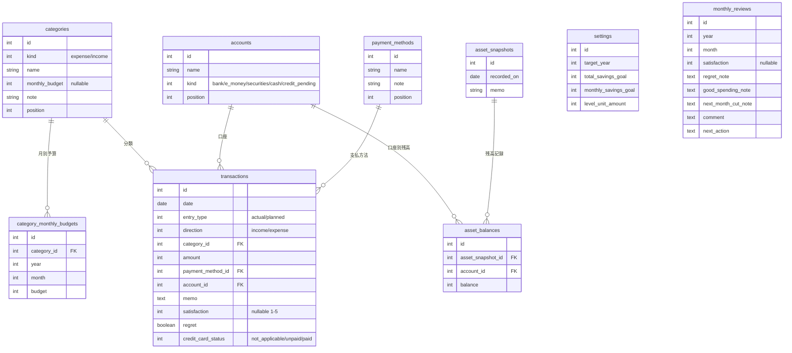

# 家計簿アプリケーション 要件定義書

## 0. 位置づけ

本書は `docs/家計簿_2026.xlsx`（Excel家計簿「MONEY QUEST」）の内容・運用ルールを分析し、それをWebアプリケーション（Ruby on Rails）として再構築するための要件定義書である。既存Excelの列構成・マスタデータ・集計ロジックを踏襲しつつ、入力の手間や数式の壊れやすさといったExcel運用の課題を解消することを目指す。

- 分析対象: `docs/家計簿_2026.xlsx`（シート: 使い方 / DB / 取引入力 / 資産管理 / 月別集計 / 予算・設定 / 月次振り返り）
- 移行先: 本リポジトリの Rails アプリ（Ruby 3.3.2 / Rails 7.1.6 / MySQL / RSpec / Hotwire）

## 1. 背景・目的

利用者はこれまでExcelで家計簿「MONEY QUEST」を運用していた。日々の収支・資産残高・月末振り返りを手入力し、ダッシュボードシートで貯金の進捗をゲーム風（プレイヤーステータス、貯金レベル）に可視化して継続のモチベーションにしている。

Excel運用には以下の課題がある。

- 数式が入ったセル（青灰セル）を誤って編集すると壊れる
- スマホなど端末を問わず入力しづらい
- カテゴリや口座をマスタとして安全に追加・変更する仕組みが弱い
- 複数シートの数式連携が複雑で、機能追加のたびに壊れるリスクが高まる

本アプリでは、Excel版の「入力のしやすさ」「ダッシュボードでの可視化」「ゲーミフィケーション」という体験は維持しつつ、データはRDB（MySQL）で管理し、集計はアプリケーションロジックで安全に行う。

## 2. 用語

| 用語 | 意味 |
|---|---|
| 取引（トランザクション） | 収入または支出の1件の記録（Excel「取引入力」シート1行に相当） |
| 資産スナップショット | ある時点での口座・証券・現金などの残高記録（Excel「資産管理」シート1行に相当） |
| 実績 / 予定 | 取引の入力区分。確定した記録か、未確定の予定（クレジットカードの引落予定など）か |
| 予算対象 | その取引を月次予算の消費に含めるかどうかのフラグ（対象 / 対象外 / 予定） |
| クレカ仮置き | クレジットカード利用時に、引落までの間に一時的に計上する口座区分 |
| 貯金レベル（LV） | 現在総資産を1万円=1LVとして換算したゲーム風ステータス |
| 月次振り返り | 月末に行う満足度・後悔支出・コメント等の振り返り記録 |

## 3. 想定利用者・利用シーン

- 個人（利用者本人）が日々の収支・資産残高をスマホ/PCから記録する、個人の家計簿アプリ。
- v1では**単一利用者**を前提とし、ログイン認証機能は実装しない（11章決定事項#1、9章）。
- 主な利用シーン
  - 支出・収入が発生した都度、その場でサッと記録する
  - 給料日・月末などのタイミングで各口座の残高をまとめて記録する
  - 月末に1ヶ月を振り返り、満足度や来月への改善点を記録する
  - ダッシュボードで貯金の進捗・カテゴリ別の使いすぎ具合を確認する

## 4. 移行元Excelの構成（現状分析）

| シート名 | 役割 | 備考 |
|---|---|---|
| 使い方 | 操作ルールの説明 | アプリ化により不要（オンボーディングUI等に置き換え） |
| DB | ダッシュボード（全体状況の閲覧） | 対象年・現在月・貯金LV・貯金目標・今月収支・予算残・年間収支・総資産・カテゴリ別支出・グラフ2種 |
| 取引入力(ここ！) | 収入・支出の入力（メインの入力画面） | 日々の記録の中心。テーブル名 `TransactionsTable`（A5:O1005） |
| 資産管理(ここ！) | 口座・証券・現金の残高記録 | テーブル名 `AssetsTable`。任意タイミングで記録 |
| 月別集計(編集なし) | 月ごとの自動集計（閲覧専用） | テーブル名 `MonthlySummaryTable`。コメント列のみ手入力可 |
| 予算・設定(ほぼ編集なし) | カテゴリ・予算・口座・支払方法のマスタ設定 | 月別の予算上書き表も持つ |
| 月次振り返り(月末のみ) | 月末の振り返り記録 | テーブル名 `MonthlyReviewTable` |

### 4.1 取引入力シートの列構成

| 列 | 項目 | 内容 |
|---|---|---|
| A | 日付 | 取引発生日 |
| B | 入力区分 | 実績 / 予定 |
| C | 収支区分 | 支出 / 収入 |
| D | カテゴリ | マスタ（予算・設定シート）から選択 |
| E | 金額 | 数値 |
| F | 支払・入金方法 | 現金 / 口座引落 / PayPay / クレカ / 銀行振込 / 証券入金 / その他 |
| G | 口座・置き場所 | マスタ（口座一覧）から選択。クレカ利用時は「クレカ仮置き」 |
| H | メモ | 自由記述 |
| I | 満足度 | 1〜5 |
| J | 後悔フラグ | はい / いいえ |
| K | クレカ支払状況 | 対象外 / 未払 / 支払済（クレカ利用時のみ運用） |
| L | 年（自動） | 日付から算出 |
| M | 月（自動） | 日付から算出 |
| N | 予算対象（自動） | 収支区分・入力区分から「対象 / 対象外 / 予定」を判定 |
| O | 入力チェック（自動） | 入力漏れチェック |

クレジットカード運用ルール: 利用時は 支払方法=クレカ、口座=クレカ仮置き、支払状況=未払 として記録し、実際の引落日に支払状況を支払済へ変更する。

### 4.2 資産管理シートの列構成

記録日、年・月（自動）、口座別残高（ゆうちょ／三井住友／三菱UFJ／PayPay／PayPay証券／SBI証券／現金）、合計資産（自動合計）、目標との差（自動）、メモ。口座列は「予算・設定」の口座マスタと連動する想定。

### 4.3 予算・設定シートのマスタ構成

- 全体貯金目標、毎月貯金目標、対象年
- 支出カテゴリ一覧＋基本月予算＋備考（例: 食費, 外食(23,000円), カフェ・コンビニ(3,000円), 交通費(2,000円), 日用品, 家賃, 水道光熱費, 通信費(8,000円), サブスク(4,000円), 服・美容(5,000円), 医療, 交際費, 趣味(10,000円), 野球観戦(10,000円), 旅行, 書籍・学習, ゲーム・アプリ, 家電・大きな買い物, 税金・保険, その他(10,000円), 固定NISA(50,000円) 等）
- 収入カテゴリ一覧＋備考（給与, ボーナス, 交通費精算, 臨時収入, その他収入）
- 口座・置き場所一覧＋種別（銀行／電子マネー／証券／現金／未払管理）
- 支払・入金方法一覧＋備考
- **月別予算上書き表**: カテゴリごとに1月〜12月の予算を個別に上書きできる（初期値は基本月予算を参照）

### 4.4 ダッシュボード（DBシート）の表示内容

- PLAYER STATUS: 対象年、現在月、貯金LV（1万円=1LV）、貯金目標、毎月目標
- 今月の収入予定 / 現時点での今月支出 / 今月の収支 / 予算残額
- 年間収入 / 年間支出
- 現在総資産 / 貯金目標進捗（%） / クレカ未払仮置き（合計）
- カテゴリ別 今月支出（予算比較付きの一部カテゴリ＋全カテゴリの一覧）
- 月別の「収入予定込」「支出実績」テーブル（グラフ用）
- グラフ①: 年間 収入予定込 / 支出実績 の推移（折れ線グラフ）
- グラフ②: カテゴリ別 今月支出（棒グラフ）

### 4.5 月別集計シート（自動集計・閲覧用）

月ごとに: 収入予定込 / 収入実績 / 支出実績 / 実績収支 / 月予算 / 予算残 / 毎月貯金目標 / 貯金達成率 / 累計収支 / コメント（手入力可）。

### 4.6 月次振り返りシート

月ごとに: 収入実績・支出実績・予算残（自動反映）＋ 満足度(1-5)・後悔支出・良かった支出・来月削るもの・コメント・次の一手（手入力）。

## 5. 機能要件

### 5.1 取引管理（Transactions）

- 取引の登録・編集・削除・一覧表示ができる。
- 入力項目: 日付, 入力区分(実績/予定), 収支区分(収入/支出), カテゴリ, 金額, 支払・入金方法, 口座・置き場所, メモ, 満足度(1-5, 任意), 後悔フラグ(任意), クレカ支払状況。
- カテゴリ・口座・支払方法は登録済みマスタから選択する（Excelの黄色セル手入力→ドロップダウン選択に相当）。
- Excelの入力漏れチェック（O列「入力チェック」）に相当する検証は、アプリではフォームのバリデーションで行う。日付・収支区分・カテゴリ・金額・支払方法・口座を必須項目とし、未入力時は保存できない。
- 「年」「月」「予算対象」はモデル側で日付・収支区分・入力区分から自動的に導出し、ユーザーは入力しない。
- クレジットカード運用（利用時=未払、引落日に支払済へ変更）をサポートする。一覧から未払の取引をまとめて「支払済」に更新できる操作があると望ましい。
- 一覧は日付・カテゴリ・収支区分・入力区分（実績/予定）で絞り込みできる。

### 5.2 資産管理（Asset Snapshots）

- 任意の日付で、口座ごとの残高をまとめて記録できる（毎日ではなく、給料日や月末など任意タイミング）。
- 記録した口座残高の合計（合計資産）と、貯金目標との差を自動計算して表示する。
- 口座はマスタ管理された口座一覧から動的に構成する。Excelでは口座が列固定（8種）だったが、アプリでは口座マスタ（5.3）から自由に追加・削除できるようにする。
- 資産の履歴（推移）を一覧・グラフで確認できる。

### 5.3 マスタ管理（カテゴリ・口座・支払方法・予算設定）

- 支出カテゴリ・収入カテゴリ・口座・支払方法をそれぞれ登録・編集・削除（または無効化）できる。
- 支出カテゴリには基本月予算を設定できる。
- カテゴリごとに月別（1〜12月）の予算上書きを設定できる（Excelの月別予算表に相当）。未設定の月は基本月予算を使用する。
- 対象年、全体貯金目標、毎月貯金目標を設定できる。

### 5.4 ダッシュボード

- 貯金レベル（現在総資産 ÷ レベル換算額、切り捨て。詳細は5.7）とレベル表示（ゲーミフィケーション要素）。
- 貯金目標・毎月目標に対する進捗（総資産の目標進捗率、当月貯金額の達成率）。
- 当月の収入予定込み金額・支出実績・収支・予算残額。
- 年間収入・年間支出（実績ベース）。
- 現在総資産、クレジットカード未払（仮置き）金額の合計。
- カテゴリ別の当月支出一覧（予算に対する消費率を含む）。
- 月別の収入・支出推移グラフ（折れ線）。
- カテゴリ別支出グラフ（棒グラフ）。

### 5.5 月別集計

- 取引データから月ごとの収入予定込み・収入実績・支出実績・実績収支・月予算・予算残・貯金達成率・累計収支を自動集計して表示する（手入力なしの導出データ）。
- Excelでは本シート（K列）と「月次振り返り」の両方にコメント欄があったが、アプリでは月次振り返り側のコメントに一本化する（本画面はコメント入力欄を持たない、完全に閲覧専用の集計画面とする）。

### 5.6 月次振り返り

- 月末に、その月の満足度(1-5)・後悔支出・良かった支出・来月削るもの・コメント・次の一手を記録できる。このコメントが月ごとのコメントの唯一の入力箇所となる（5.5の月別集計とのコメント欄重複を統合）。
- その月の収入実績・支出実績・予算残は自動表示（取引データから算出、手入力不要）。

### 5.7 ゲーミフィケーション

- 「貯金レベル」をダッシュボードに表示する。計算式は「現在総資産 ÷ レベル換算額（初期値: 1万円）」とし、レベル換算額は設定画面で変更可能とする（Excelでは1万円=1LV固定だったが、アプリでは可変にする）。
- 貯金目標に対する進捗をレベルバー等で視覚的に表現する。
- （将来拡張の余地: レベルアップ通知、バッジ、連続記録日数など。v1では現状Excel相当の表示のみとする）

## 6. データモデル（概略ER）



`settings`と`monthly_reviews`は他テーブルとの外部キー関連を持たない（`monthly_reviews`は`year`/`month`でカテゴリ横断の月次集計に対応する形）。

テーブル定義（DDL相当）:

```
categories
  id, kind(enum: expense/income), name, monthly_budget(int, nullable), note, position

category_monthly_budgets      # カテゴリの月別予算上書き
  id, category_id, year, month, budget(int)

accounts
  id, name, kind(enum: bank/e_money/securities/cash/credit_pending), position

payment_methods
  id, name, note, position

transactions
  id, date, entry_type(enum: actual/planned), direction(enum: income/expense),
  category_id, amount, payment_method_id, account_id, memo,
  satisfaction(int, nullable 1-5), regret(boolean, default false),
  credit_card_status(enum: not_applicable/unpaid/paid, nullable)
  # 年・月・予算対象は date/direction/entry_typeから導出するため保持しない（もしくは検索用に非正規化カラムとして持つ）

asset_snapshots
  id, recorded_on, memo

asset_balances                # スナップショットと口座の中間テーブル
  id, asset_snapshot_id, account_id, balance

settings
  id, target_year, total_savings_goal, monthly_savings_goal,
  level_unit_amount(int, default: 10000)   # 貯金レベル換算額（現在総資産 ÷ この値 = LV）

monthly_reviews
  id, year, month, satisfaction(int, nullable), regret_note, good_spending_note,
  next_month_cut_note, comment, next_action
```

補足:
- 月別集計・ダッシュボードの数値は上記テーブルから都度計算する（Excelのように別シートに数値を保持しない）。
- 「予算対象」の判定ロジック（実績/予定・収支区分から導出）はアプリケーション側のドメインロジックとして実装する。

## 7. 画面一覧（案）

| 画面 | 対応するExcelシート | 概要 |
|---|---|---|
| ダッシュボード | DB | アプリのトップ画面。貯金LV・進捗・当月収支・カテゴリ別支出・グラフ |
| 取引一覧・入力 | 取引入力 | 取引のCRUD、フィルタ、クレカ未払の一括支払済化 |
| 資産管理 | 資産管理 | 残高スナップショットのCRUD、資産推移グラフ |
| 月別集計 | 月別集計 | 月別の自動集計テーブル（閲覧） |
| 月次振り返り | 月次振り返り | 月ごとの振り返り入力・一覧 |
| 設定（カテゴリ／口座／支払方法／予算） | 予算・設定 | マスタ管理、対象年・貯金目標設定、月別予算上書き |

## 8. データ移行方針

- `docs/家計簿_2026.xlsx` に入っている2026年分の実データ（取引入力・資産管理・予算・設定のマスタ）を、初期データ移行用のスクリプト（rakeタスク or `db/seeds.rb`）でインポートする。
- 移行対象: 支出/収入カテゴリと基本月予算、口座一覧、支払方法一覧、取引データ（現状 実績14件・予定1件程度）、資産スナップショット（現状10件）、月次振り返り（現状1件）、対象年・貯金目標などの設定値。
- 移行後、Excel側は参照用として残し、以後の記録はアプリ側に一本化する。

## 9. 非機能要件

- 実行環境: 本リポジトリのRailsアプリ（Ruby 3.3.2 / Rails 7.1.6 / MySQL / Hotwire(importmap) / RSpec）に準拠する。
- 想定利用者数・アクセス数は少数（個人利用）のため、大規模なスケーラビリティは要件としない。
- 金額は日本円の整数（小数なし）で扱う。
- v1は本人単独利用を前提とし、ログイン認証機能は実装しない。外部公開や複数利用者対応が必要になった時点で、認証（Devise等）とユーザーモデルの追加を検討する。
- スマートフォンからの入力を想定し、レスポンシブなUIとする。

## 10. スコープ外（v1では対応しない）

- 複数ユーザーでの利用・権限管理
- 銀行/クレジットカードとの自動連携（API連携、CSV自動取込）
- レシート画像のOCR読み取り
- プッシュ通知・リマインダー
- 「使い方」シートに相当するヘルプ機能（別途UIのヒント表示等で必要に応じて対応）

## 11. 決定事項ログ

初版作成時点で機械的に読み取れず利用者判断が必要だった点について、以下の通り決定した（2026-08-13）。各決定は本文の該当箇所に反映済み。

| # | 論点 | 決定 | 反映箇所 |
|---|---|---|---|
| 1 | 利用者・認証 | v1は本人単独利用とし、認証機能は実装しない | 9章 |
| 2 | 月別集計と月次振り返りのコメント欄の重複 | 月次振り返り側に統合し、月別集計はコメント入力欄を持たない完全閲覧専用画面とする | 5.5, 5.6 |
| 3 | 口座の動的追加 | Excelの列固定（8種）をやめ、口座マスタで自由に追加・削除できるようにする | 5.2, 5.3 |
| 4 | 入力漏れチェック（Excel O列相当） | フォームのバリデーションで必須項目化する（日付・収支区分・カテゴリ・金額・支払方法・口座） | 5.1 |
| 5 | 予定（planned）取引の用途 | クレジットカードの引落予定以外の用途は特になし。追加のユースケース検討は不要 | 5.1（変更なし） |
| 6 | 貯金レベルの計算式 | 「1万円=1LV」を固定値ではなく設定で変更可能な値とする | 5.7, 6章`settings.level_unit_amount` |
